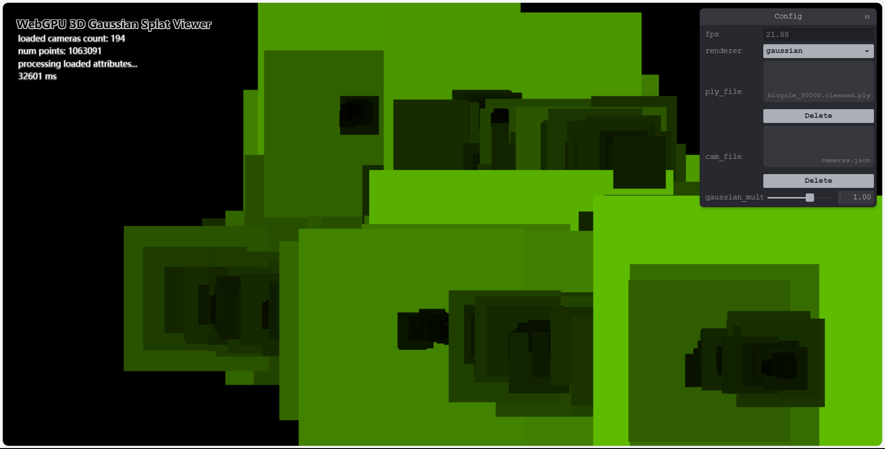
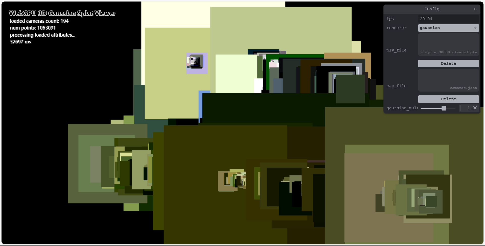
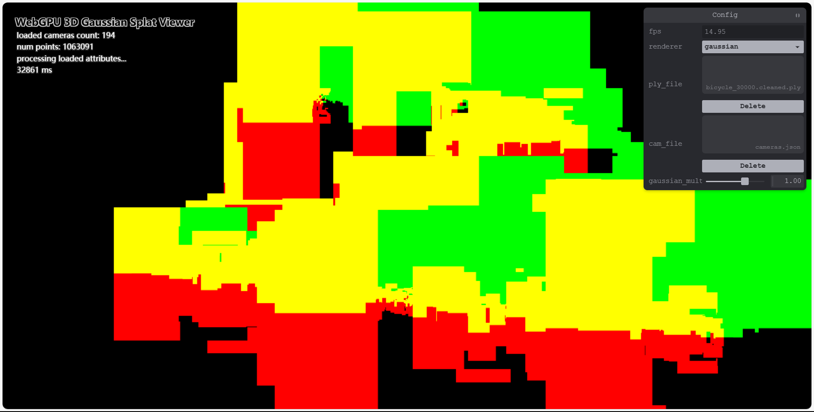
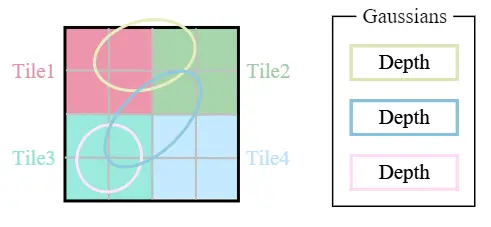

WebGPU WebGPU Gaussian Splat Viewer Instructions
==========================================================

**This is due Tuesday, October 29th at 11:59 PM.**

In this project, you will implement the 3D Gaussian Splat Viewer. You are given some pretrained Gaussian files and basic loading function, as well as some GUIs including file loading and renderer switch.

## Contents

- `src/` contains all the TypeScript and WGSL code for this project. This contains several subdirectories:
  - `renderers/` defines the different renderers in which you will implement gaussian renderer.
  - `shaders/` contains the WGSL files that are interpreted as shader programs at runtime. 
  - `camera/` includes camera controls, camera file loading.
  - `utils/` includes PLY file loading, utility functions for debugging. 

<b>Scene Files: </b> download scene files from [drive](https://drive.google.com/drive/folders/1UbcFvkwZhcdnhAlpua7n-UUjxDaeiYJC?usp=sharing).

## Running the code

Follow these steps to install and view the project:
- Clone this repository
- Download and install [Node.js](https://nodejs.org/en/)
- Run `npm install` in the root directory of this project to download and install dependencies
- Run `npm run dev`, which will open the project in your browser
  - The project will automatically reload when you edit any of the files

### Notes:

- The project will **not** work immediately after being cloned and set up as there are some tasks for you to complete to get it up and running (see [the project instructions](#part-1-implement-the-different-rendering-methods)).
- Browsers and GPUs
  - This project requires a WebGPU-capable browser. Ensure that you can see the Sponza scene being renderered using this [WebGPU test](https://toji.github.io/webgpu-test/).
    - Google Chrome seems to work best on all platforms.
    - Try [Google Chrome Canary](https://www.google.com/chrome/canary/) for the latest updates.
  - If you have problems running the starter code, use Chrome and make sure you have updated your browser and video drivers.
  - Remember to follow steps from [Project 0](https://github.com/CIS5650-Fall-2024/Project0-Getting-Started/blob/main/INSTRUCTION.md#part-23-project-instructions---webgpu) if needed.
- Ensure that the `Adapter Info -> Description` on https://webgpureport.org/, is your main GPU. Often your low-powered GPU will be selected as default. To make a permanent switch, use your OS's GPU Settings to make the GPU default for your browser.

### Debugging Tools

- You can use the standard console debugger in the browser’s developer tools to inspect and debug your code.
- Additionally, you can utilize the [Chrome WebGPU Developer Tools extension](https://chromewebstore.google.com/detail/webgpu-devtools/ckabpgjkjmbkfmichbbgcgbelkbbpopi) to capture frames and inspect detailed GPU-related information.
  - Once you have installed the extension in Chrome, access the WebGPU panel by navigating to: **Developer Tools -> More Tools -> WebGPU**.
  - Please note that the extension is currently in an unstable state. If the reset button doesn't function as expected, try reopening the tab to refresh the panel.

### GitHub Pages setup

Since this project uses WebGPU, it is easy to deploy it on the web for anyone to see. To set this up, do the following:
- Go to your repository's settings
- Go to the "Pages" tab
- Under "Build and Deployment", set "Source" to "GitHub Actions"

You will also need to go to the "Actions" tab in your repository and enable workflows there.

Once you've done those steps, any new commit to the `main` branch should automatically deploy to the URL `<username>.github.io/<repo_name>`.

## Requirements

**Ask on Ed Discussion for any clarifications.**

In this project, you are given code for:
- ply scene loading
- camera json file loading
- radix sort compute shader
- point cloud renderer
- skeleton code for gaussian renderer

For editing the project, you will want to use [Visual Studio Code](https://code.visualstudio.com/). Once you've installed VSCode, you can open the root folder of this project using "File > Open Folder..." to start coding. You may also find [this extension](https://marketplace.visualstudio.com/items?itemName=PolyMeilex.wgsl) useful for highlighting WGSL syntax.

WebGPU errors will appear in your browser's developer console (Ctrl + Shift + J for Chrome on Windows). Unlike some other graphics APIs, WebGPU error messages are often very helpful, especially if you've labeled your various pipeline components with meaningful names. Be sure to check the console whenever something isn't working correctly.

### Part 1: Understanding 3D Gaussian Point Cloud & Add MVP calculation (10pts)
- Read over the [3D Gaussian Splatting Paper](https://repo-sam.inria.fr/fungraph/3d-gaussian-splatting/) to have a basic understanding. 
- Then read over `point_cloud` renderer, add MVP calculation to the vertex shader. After that, you can see yellow point cloud rendered to screen. 

### Part 2: Gaussian Renderer (80pts total)(50pts(preprocess)+30pts(renderer))

#### Gaussian Renderer Pipeline Overview: 
  - Loading 3D gaussian data into GPU (this part is done for you, see `PointCloud` in load.ts)
  - Preprocess 3D gaussian data
    - Implement view frustum culling to remove non-visible Gaussians (make bounding box to be slightly larger to keep the edge gaussians)
    - Compute 3D covariance based on rotation and scale, also user inputted gaussian multipler. (see [post](https://github.com/kwea123/gaussian_splatting_notes) on 1.1 section)
    - Compute 2D conic, maximum radius, and <b>maximum quad size in NDC</b> (see [post](https://github.com/kwea123/gaussian_splatting_notes) on 1.1 section)
    - Using spherical harmonics coeffiecients to evaluate the color of the gaussian from particular view direction (evaluation function is provided, see [post](https://beatthezombie.github.io/sh_post_1/)  ). 
    - Store essential 2D gaussian data for later rasteriation pipeline
    - Add key_size, indices, and depth to sorter. 
  - Sort Gaussians based on depth
  - Render the 2D splat on quad utlizing indirect draw call (instance count from process step) in sorted order.
    - vertex shader: reconstruct 2D quad vertices (NDC) from splat data, send conic and color information to fragment shader
    - fragment shader: using conic matrix [see "Centered matrix equation"](https://en.wikipedia.org/wiki/Matrix_representation_of_conic_sections) and [CUDA implementation](https://github.com/graphdeco-inria/diff-gaussian-rasterization/blob/main/cuda_rasterizer/forward.cu#L330) to determine whether point is inside splat. The opacity should decade exponentially as it distant from center.

#### Implementation Hints:
- scene file information:
  - `opacity`: use  function to bring back maximum opacity
  - `scale` (log space): use exponential function to bring back actual scale
- useful shader functions:
  - `unpack2x16float`: all gaussian data is packed in f16, need to unpacked it in shader. 
  - `pack2x16float`: pack you 2D gaussian data in f16 format
  - `atomicAdd` : store indices in sorting buffer using thread-safe updates in compute shaders
  - `arrayLength`: remember to check thread idx is within the numbers of gaussians
- Setting up pipeline:
  - `device.queue.writeBuffer`: Remember to clean sort infos each frame.  
  - `encoder.copyBufferToBuffer`: GPU buffer transfer data to other GPU buffer
  - `blend`: using similar blending function as rendering semi-transparent texture to screen. 
  - `depth`: similarly to semi-transparent texture, we should render gaussians back to front. 

#### <b>Implementation Step Recommendation:</b>

<b>Recommedation test scene:</b> bonsai_30000.ply or bicycle_30000.cleaned.ply

<b>Indirect Drawing Setup Suggestions: </b>

Before working on the preprocessing compute pipeline, you should first set up the indirect rendering pipeline that replicates the point cloud rendering you did in part 1. The recommended workflow is as follows:

1. Set up the indirect draw buffer and the render pipeline, and render pc.num_points number of quads (with smaller size such as 0.01 x 0.01) on the screen.
2. Finish the compute pipeline by binding the correct buffers. In the preprocess shader, transform the Gaussian points from world space to NDC space and stored data in Splat (similar to point cloud renderer). In the render pipeline, read from this Splat buffer to determine the position for drawing the quad. 
3. Now, implement a simple view-frustum culling (bounding box of 1.2x screen size is recommended). Instead of drawing pc.num_points quads through the hard-coded indirect buffer, use `atomicAdd` on `sort_infos.keys_size` to determine how many quads to draw. After the preprocess shader, use `sort_infos.keys_size` to update the indirect draw buffer's instance count. Now the total number of quads to render is determined by the preprocess shader.
4. The final step for setup is to bind the render settings as a buffer, as declared in the shader. The Gaussian scaling member variable should be adjustable on the host side using a scroll bar (see in `renderer.ts`).

To test whether the buffer is working, use the Gaussian scaling member to influence the quad size, allowing you to adjust the size of the quads with the scroll bar. Also, be careful that complier might optimize away shader binding buffer if you do not actually use it in shader functions. 

<b>Preprocess Compute Setup Suggestions: </b>

Now, implement the computation of the 3D covariance, 2D covariance, and finally the radius, as detailed in the post links provided above. After computing the radius, use it to determine the quad size. You can load `bicycle_30000.cleaned.ply` (default camera) and compare it with the provided image below:

After computing the radius, you can implement sorting by specifying `sort_depths` and `sort_indices` for each visible Gaussian. Also, remember to use `atomicAdd` on `sort_dispatch.dispatch_x` every time the visible Gaussian count exceeds the total number of sorting threads you will dispatch. To visualize the sorting result, assign each quad a color determined by its size, for example, `(width, height, 0.0, 1.0)` as the RGBA. 

Then, bind the `sh_buffer` created in `load.ts` to the preprocess pipeline. Using this buffer, you can complete the `sh_coef` function, which reads a color from the sh_buffer given its index. With this function implemented, the `computeColorFromSH` function will be functional, allowing you to call it to acquire the color of each Gaussian. Pass the color from the preprocess shader to the rendering shaders to colorize each quad. As a result, you should see the following:

<b>Final Render Implementation Suggestions: </b>

Finally, enable `alpha` blending in the render pipeline. In the fragment shader, use a conic matrix to determine whether a point is inside a splat, and compute the opacity to update each fragment's color. There are multiple ways to achieve the final result, but here are some milestone images for you to compare.

To determine whether a point is inside a splat, you need to compute the offset from the fragment position to the center of the quad in pixel space, with the x-coordinate reversed. To verify that your distance offset is computed correctly, set the color to `(d.x, d.y, 0.0, 1.0)`; you should see the following image:

### Part 3: Extra Credit: 

#### Optimization: tile-based depth sorting (20pts)

Follow the [paper](https://github.com/kwea123/gaussian_splatting_notes) implementation using tile-based depth sorting. Then composite the final image using compute shader. 

#### Optimization: half-precision floating point calculation (10pts)

See the [WebGPU supported f16 function](https://webgpufundamentals.org/webgpu/lessons/webgpu-wgsl-function-reference.html), implement your compressed f16 compute shader for preprocess step. 

## Performance Analysis (10pts)

#### Answer these questions:
- Compare your results from point-cloud and gaussian renderer, what are the differences?
- For gaussian renderer, how does changing the workgroup-size affect performance? Why do you think this is?
- Does view-frustum culling give performance improvement? Why do you think this is? 
- Does number of guassians affect performance?  Why do you think this is? 

## Base Code Walkthrough

In general, you can search for comments containing "TODO" to see the most important/useful parts of the base code.

#### `renderers/`
Defines the different renderers for Gaussian splats and point clouds.
- **`gaussian-renderer.ts`**: Implements the renderer for Gaussian splats.
- **`point-cloud-renderer.ts`**: Implements the renderer for point clouds.
- **`renderer.ts`**: Abstract base render app for common renderer functionality, as well as GUI.

#### `shaders/`
Contains WGSL shader programs that run on the GPU for rendering.
- **`gaussian.wgsl`**: Vertex and fragment shaders for Gaussian splat rendering.
- **`point_cloud.wgsl`**: Shaders for rendering point cloud data.
- **`preprocess.wgsl`**: Preprocesses Gaussian data for rendering.

#### `camera/`
Manages camera controls and view/projection transformations.
- **`camera.ts`**: Handles the camera's view and projection matrices.
- **`camera-control.ts`**: Implements user input handling for camera movement.

#### `utils/`
Includes PLY file loading and utility functions for debugging and GPU management.
- **`load.ts`**: Loads Gaussian PLY data, and sets up WebGPU buffers.
- **`plyreader.ts`**: Parses PLY files to extract point cloud data.
- **`simple-console.ts`**: Provides basic logging and debugging utilities.
- **`util.ts`**: Provides utility functions for assertions, error handling, and alignment operations.

#### `sort/`
Handles sorting operations for rendering transparency in Gaussian splats.
- **`sort.ts`**: Interfaces with the radix sort WGSL shader to sort Gaussian splats by depth.
- **`radix_sort.wgsl`**: Implements parallel radix sort on the GPU.

#### `main.ts`
The entry point of the project, responsible for initializing WebGPU.

## README

Replace the contents of `README.md` with the following:
- A brief description of your project and the specific features you implemented
- At least one screenshot of your project running
- A 30+ second video/gif of your project running showing all features (even though your demo can be seen online, it may not run on all computers, while a video will work everywhere)
- A link to your project's live website (see [GitHub Pages setup](#github-pages-setup))

## Submit

Open a GitHub pull request so that we can see that you have finished. The title should be "Project 4: YOUR NAME". The template of the comment section of your pull request is attached below, you can do some copy and paste:

- Repo Link
- Briefly mention features that you've completed, especially those bells and whistles you want to highlight:
  - Feature 0
  - Feature 1
  - ...
- Feedback on the project itself, if any.

### Third-Party Code Policy

- Use of any third-party code must be approved by asking on Ed Discussion.
- If it is approved, all students are welcome to use it. Generally, we approve use of third-party code that is not a core part of the project. For example, for the path tracer, we would approve using a third-party library for loading models, but would not approve copying and pasting a CUDA function for doing refraction.
- Third-party code **MUST** be credited in README.md.
- Using third-party code without its approval, including using another student's code, is an academic integrity violation, and will, at minimum, result in you receiving an F for the semester.
